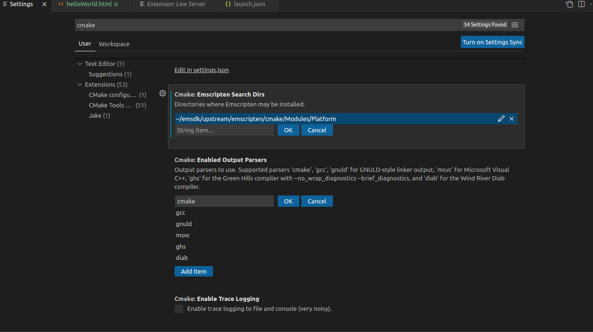

# TwoLayerFlowVisual

The goal of the project is to have a nice visual display of
two layer flow (for shallow and deep) inside a browser
which will adjust the type of flow given the bounding box size

Personal goal is to learn more about WebAssembly and writing
C++ code that can be run inside the browser

## Resources:

https://emscripten.org/docs/getting_started

https://medium.com/swlh/i-made-a-game-in-c-run-in-a-web-browser-and-so-can-you-2911b9fe2368

https://developer.mozilla.org/en-US/docs/WebAssembly/C_to_wasm

Cmake with VS code in linux
https://code.visualstudio.com/docs/cpp/cmake-linux

Sample WASM from CMake
https://github.com/adevaykin/minimal-cmake-emscripten-project

Setting up CMake projects for C++ with subdirectories
https://www.youtube.com/watch?v=SYgESCQeGJY

To setup the emc flags
https://github.com/emscripten-core/emscripten/issues/11817

---

Setting up the Build process using VSCode

- Make sure that cmake works
- Set up VSCode cmake settings to use the Emscripten tool chain; Make sure that it is pointed to the right spot where the EMScripten sdk is.
  

---

Webgl tutorial

https://developer.mozilla.org/en-US/docs/Web/API/WebGL_API

https://github.com/invent-box/Learn-WebGL

https://www.youtube.com/watch?v=bP7_FeP9kU4&list=PL2935W76vRNHFpPUuqmLoGCzwx_8eq5yK&index=2

---

To Build
Run:

bash generateBuild.sh

Still need to figure out how to get the .html file working
